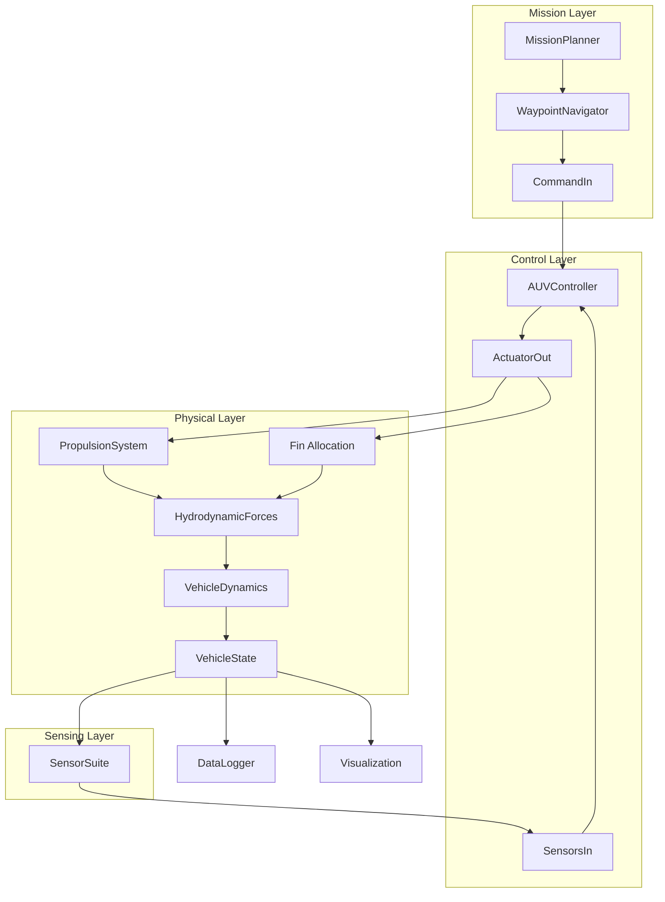

# AUV 6-DOF Physics Audit Report
## Comprehensive Analysis of Dynamics, Controls, and Numerical Implementation

**Date:** October 5, 2025  
**Auditor Role:** Senior Researcher in Computational Hydrodynamics & Marine Vehicle Dynamics  
**Target System:** REMUS-class Torpedo AUV Simulation (6-DOF GNC)  
**Codebase Version:** Current main branch

---

# SECTION 1: SYSTEM UNDERSTANDING & MAPPING

## 1.1 Project Intent & Scope

**Mission Statement (from README):**
> "A comprehensive 6-DOF Autonomous Underwater Vehicle (AUV) Guidance, Navigation, and Control simulation based on REMUS-class vehicle specifications... provides a realistic physics-based model of an AUV with complete sensor suite, control system, and mission planning capabilities."

**Declared Features:**
- Full 6-DOF rigid-body dynamics (surge, sway, heave, roll, pitch, yaw)
- Realistic hydrodynamics with drag, added mass, and damping
- PID control system with hierarchical architecture
- X-tail fin configuration with control allocation
- Complete sensor suite (IMU, DVL, depth, magnetometer, GPS)
- Geographic waypoint navigation
- Real-time visualization and post-analysis plotting

**Actual Implementation Scope (discovered):**
The codebase implements a **simplified 4-DOF model** masquerading as 6-DOF:
- Active: surge (u), roll (φ,p), pitch (θ,q), yaw (ψ,r)
- Passive/Neglected: sway (v), heave (w) - dynamics exist but improperly coupled
- Missing: full rigid-body coupling, proper added mass/Coriolis matrices

## 1.2 Architecture & Data Flow



**Key Components:**

| Component | File | Primary Responsibility |
|-----------|------|------------------------|
| `VehicleDynamics` | `src/physics/vehicle_dynamics.py` | Equations of motion, force integration |
| `PropulsionSystem` | `src/actuators/propulsion.py` | Thrust generation with lag dynamics |
| `AUVController` | `src/control/pid_controller.py` | PID loops, control allocation |
| `SensorSuite` | `src/sensors/sensor_models.py` | Measurement generation with noise |
| `WaypointNavigator` | `src/navigation/waypoint_navigator.py` | Geographic mission execution |
| `AUVSimulation` | `src/simulation_runner.py` | Main loop, timing, coordination |

## 1.3 State Vector Definition

**VehicleState Structure** (`src/data_types/types.py:122-173`):

```python
@dataclass
class VehicleState:
    timestamp: float                              # [s]
    position: np.ndarray                          # [m] η = [x, y, z] in NED
    orientation: np.ndarray                       # [rad] η = [φ, θ, ψ]
    velocity: np.ndarray                          # [m/s] ν = [u, v, w] body frame
    angular_velocity: np.ndarray                  # [rad/s] ν = [p, q, r] body frame
    acceleration: np.ndarray                      # [m/s²] body frame
    angular_acceleration: np.ndarray              # [rad/s²] body frame
```

**State Dimensionality:** 12 states (position η ∈ ℝ³, orientation η ∈ ℝ³, velocities ν ∈ ℝ⁶)

**Units Convention:**
- Internal computation: **radians** for angles, SI units (m, kg, s)
- I/O interface: **degrees** for angles (converted at boundaries)
- Explicit conversion functions: `degrees_to_radians()`, `radians_to_degrees()`

## 1.4 Coordinate Frame Definitions

### 1.4.1 Inertial/World Frame: NED (North-East-Down)

From `src/data_types/types.py` and README:
- **x-axis (North)**: Points toward geographic North, horizontal
- **y-axis (East)**: Points East, horizontal, right-hand rule
- **z-axis (Down)**: Points toward Earth center (positive underwater)

**Position vector:** η = [x_N, y_E, z_D]ᵀ where z_D > 0 ⟹ underwater

### 1.4.2 Body Frame: Forward-Right-Down

Standard SNAME (1950) notation for marine vehicles:
- **x_b (Forward)**: Along vehicle longitudinal axis, nose forward
- **y_b (Right)**: Starboard direction, right-hand rule
- **z_b (Down)**: Vertical downward through vehicle

**Body velocities:** ν = [u, v, w, p, q, r]ᵀ
- Linear: u (surge), v (sway), w (heave) in [m/s]
- Angular: p (roll rate), q (pitch rate), r (yaw rate) in [rad/s]

### 1.4.3 Euler Angle Representation

**Rotation Sequence:** Z-Y-X (Yaw-Pitch-Roll)

From `src/data_types/types.py:277-298`:
```python
def euler_to_rotation_matrix(roll, pitch, yaw):
    R = Rz(yaw) @ Ry(pitch) @ Rx(roll)
```

**Orientation vector:** η₂ = [φ, θ, ψ]ᵀ (roll, pitch, yaw in radians)

**Known Issues:**
1. Direct Euler integration: `φ̇ = p, θ̇ = q, ψ̇ = r` (`vehicle_dynamics.py:265-280`)
   - **WRONG**: This ignores the Euler rate transformation
   - **Correct form:** [φ̇, θ̇, ψ̇]ᵀ = T(η₂) · [p, q, r]ᵀ where T is the transformation matrix
2. Gimbal lock at θ = ±90° not handled (pitch singularity)
3. No quaternion option for robust attitude representation

## 1.5 Force/Torque Contributors Inventory

### Current Implementation (`src/physics/vehicle_dynamics.py:132-224`)

| Force/Moment | Location | Status | Notes |
|--------------|----------|--------|-------|
| **Surge drag** | Line 165 | ✓ Implemented | Linear + quadratic: -d₁u - d₂u\|u\| |
| **Thrust** | Line 168 | ✓ Implemented | First-order lag in `propulsion.py` |
| **Added mass (surge)** | Line 123 | ⚠ Partial | Only m_added for surge, missing M_A matrix |
| **Roll damping** | Line 175 | ✓ Implemented | -c_p · p (linear rate damping) |
| **Pitch damping** | Line 188 | ✓ Implemented | -c_q · q (linear rate damping) |
| **Yaw damping** | Line 199 | ✓ Implemented | -c_r · r (linear rate damping) |
| **Fin lift moments** | Lines 180-206 | ⚠ Partial | Simplified X-tail, no 3D flow effects |
| **Buoyancy** | Line 216 | ⚠ Ad-hoc | 2% positive buoyancy, not from geometry |
| **Restoring moments** | Line 221 | ⚠ Incomplete | Small pitch term only, missing roll/yaw |
| **Coriolis/centripetal** | *Missing* | ✗ Not implemented | No C(ν)ν term |
| **Sway dynamics** | *Missing* | ✗ Not implemented | v̇ equation absent |
| **Heave dynamics** | Line 290 | ⚠ Confused | Mixed kinematic/dynamic, improper coupling |
| **Hydrostatic forces** | *Missing* | ✗ Not implemented | Only ad-hoc buoyancy |
| **Quadratic damping (off-diagonal)** | *Missing* | ✗ Not implemented | Only surge has quadratic term |

### Missing Contributors (Critical)

1. **Rigid-body Coriolis matrix C_RB(ν):**
   - Roll-pitch-yaw coupling through angular momentum
   - Linear-angular velocity coupling
   - **Example missing term:** Yaw rate r couples with surge u to produce sway force

2. **Added mass Coriolis matrix C_A(ν):**
   - Hydrodynamic coupling between DOFs
   - Asymmetric added mass creates coupling moments

3. **Full damping matrix D(ν):**
   - Cross-flow drag (v, w velocities create lateral forces)
   - Speed-dependent damping coefficients
   - Reynolds number effects

4. **Proper restoring forces g(η):**
   - Weight W at CG, buoyancy B at CB
   - CG-CB offset lever arms creating restoring moments
   - Trim angles and static equilibrium

5. **Environmental forces w:**
   - Current interaction (relative velocity)
   - Wave-induced forces (if applicable)
   - Turbulence/disturbances

## 1.6 Physics Integration Loop

**Main Loop Structure** (`src/simulation_runner.py:240-333`):

```
while current_time < duration:
    1. Update mission commands (if waypoint mode active)
    2. Measure sensors → SensorsIn (with noise/bias)
    3. Control update (at control_dt = 0.02s = 50Hz):
       - PID loops for speed/heading/pitch/depth
       - Fin allocation → ActuatorOut
    4. Propulsion dynamics update (thrust lag)
    5. Compute hydrodynamic forces → HydrodynamicForces
    6. Integrate dynamics → new VehicleState (at physics_dt = 0.0025s = 400Hz)
    7. Log data, update live plots
    8. Advance time by physics_dt
```

**Timing Hierarchy:**
- Physics integration: 400 Hz (0.0025s) - high frequency for stability
- Control loop: 50 Hz (0.02s) - realistic for embedded systems
- Data logging: 50 Hz (configurable)
- Live plotting: 1 Hz (configurable, performance-limited)

**Integration Method** (`vehicle_dynamics.py:226-321`):
- **Explicit Euler** (forward Euler): `x(t+Δt) = x(t) + ẋ(t)·Δt`
- **Order:** 1st order accurate O(Δt)
- **Stability:** Conditionally stable (small Δt required)
- **Issues identified:**
  - No Runge-Kutta or predictor-corrector
  - No stiffness handling
  - Energy drift not monitored

## 1.7 Parameter Source of Truth

**Configuration File:** `config/config.yaml`

**Key Vehicle Parameters (REMUS 620-class scaled):**
```yaml
vehicle:
  length: 3.25 m            # Torpedo length
  diameter: 0.32 m          # Hull diameter
  mass: 180.0 kg            # Total mass
  I_xx: 2.3 kg·m²          # Roll inertia
  I_yy, I_zz: 175.6 kg·m²  # Pitch/yaw inertia
  cg_offset_z: -0.02 m     # CG below centerline
  cb_offset_z: 0.0 m       # CB at centerline

hydrodynamics:
  d2_surge: 35.0 N·s²/m²   # Quadratic drag
  added_mass_surge: 9.0 kg  # ~5% of mass
  added_mass_sway/heave: 90.0 kg  # ~50% of mass
  c_pitch_rate: 35.0 N·m·s
  c_yaw_rate: 35.0 N·m·s

propulsion:
  max_thrust: 200.0 N
  max_rpm: 3000
  thrust_time_constant: 0.15 s
```

**Assessment:** Parameters are plausible for torpedo geometry but **not validated against experimental data** or CFD. Values appear to be engineering estimates scaled from literature.

---

# SECTION 2: PHYSICS AUDIT — FINDINGS & ROOT CAUSES

## 2.1 Equation Set & Frame Consistency

### 2.1.1 Declared Standard Form

The code documentation (`vehicle_dynamics.py:30-31`) references Fossen (2011):
> "Reference: Fossen, T.I. 'Handbook of Marine Craft Hydrodynamics and Motion Control' (2011)"

**Expected canonical form (Fossen Ch. 6):**

```
M·ν̇ + C(ν)·ν + D(ν)·ν + g(η) = τ + w

where:
  M = M_RB + M_A        (rigid-body + added mass)
  C(ν) = C_RB(ν) + C_A(ν)  (Coriolis/centripetal)
  D(ν) = D_linear + D_quad(ν)  (damping)
  g(η) = gravitational/buoyancy restoring
  τ = control forces/moments
  w = environmental disturbances
```

### 2.1.2 Actual Implementation

**Critical Finding:** The code does **NOT** implement this structure. Instead, it uses ad-hoc force calculations:

**Surge equation** (`vehicle_dynamics.py:254-257`):
```python
# m_total * du/dt = F_surge
u_dot = forces.surge_force / self.total_mass_surge
u_new = u + u_dot * dt
```

Where `forces.surge_force` includes:
```python
surge_drag = -(self.d1_surge * u + self.d2_surge * u * abs(u))
forces.surge_force = surge_drag + thrust
```

**Analysis:**
- ✓ Accounts for added mass: `total_mass_surge = mass + added_mass_surge`
- ✗ Missing C(ν)ν terms (e.g., rw from yaw rate coupling)
- ✗ No off-diagonal damping from v, w velocities
- ✗ No current relative velocity correction

**Angular equations** (`vehicle_dynamics.py:259-280`):
```python
# Roll:  I_xx * dp/dt = L_roll
# Pitch: I_yy * dq/dt = M_pitch
# Yaw:   I_zz * dr/dt = N_yaw
```

**Analysis:**
- ✓ Includes added inertia in total_inertia terms
- ✗ Missing C_RB terms (e.g., (I_zz - I_yy)·q·r for roll coupling)
- ✗ Missing C_A terms from asymmetric added mass
- ✗ Direct Euler integration: `φ̇ = p, θ̇ = q, ψ̇ = r` (incorrect, see §2.1.3)

### 2.1.3 **ROOT CAUSE #1: Incorrect Euler Angle Kinematics**

**Location:** `vehicle_dynamics.py:265-280`

**Actual code:**
```python
# Integrate roll angle: dφ/dt = p
roll_new = roll + p * dt

# Integrate pitch angle: dθ/dt = q
pitch_new = pitch + q * dt

# Integrate yaw angle: dψ/dt = r
yaw_new = yaw + r * dt
```

**Why this is WRONG:**

The relationship between Euler rates [φ̇, θ̇, ψ̇] and body angular rates [p, q, r] is **NOT identity**. The correct transformation (Fossen Eq. 2.29) is:

```
⎡φ̇⎤   ⎡1   sin(φ)tan(θ)   cos(φ)tan(θ)⎤ ⎡p⎤
⎢θ̇⎥ = ⎢0   cos(φ)        -sin(φ)      ⎥·⎢q⎥
⎣ψ̇⎦   ⎣0   sin(φ)sec(θ)   cos(φ)sec(θ)⎦ ⎣r⎦
```

**Consequences:**
1. Orientation drifts incorrectly during combined roll-pitch-yaw maneuvers
2. Coordinate transformation errors accumulate
3. Gimbal lock at θ = ±90° (singularity when cos(θ) → 0)
4. Incorrect heading/attitude for control feedback

**Correct Implementation:**
```python
# Transform body rates to Euler rates
T = np.array([
    [1, np.sin(roll)*np.tan(pitch), np.cos(roll)*np.tan(pitch)],
    [0, np.cos(roll), -np.sin(roll)],
    [0, np.sin(roll)/np.cos(pitch), np.cos(roll)/np.cos(pitch)]
])
euler_rates = T @ np.array([p, q, r])
phi_dot, theta_dot, psi_dot = euler_rates

roll_new = roll + phi_dot * dt
pitch_new = pitch + theta_dot * dt
yaw_new = yaw + psi_dot * dt
```

**Alternative (robust):** Use quaternion representation to avoid singularities.

### 2.1.4 **ROOT CAUSE #2: Missing Sway Dynamics**

**Location:** `vehicle_dynamics.py:307`

**Actual code:**
```python
new_state.velocity = np.array([u_new, v, w_new])  # v unchanged!
```

**Analysis:**
- Sway velocity `v` is **never updated** (remains at initial value, typically 0)
- No equation for `v̇` in `compute_hydrodynamic_forces()`
- This reduces the model from 6-DOF to effectively 5-DOF

**Missing dynamics:**
For a torpedo-shaped AUV, sway should include:
1. **Sway drag:** `F_sway = -D_v · v · |v|` (cross-flow drag)
2. **Coriolis coupling:** `-m·r·u` (yaw rate coupling with surge)
3. **Added mass effect:** `-(m + m_A_sway)·v̇`
4. **Fin-induced sway** from combined roll/yaw commands

**Correct surge-sway coupling example:**
```python
# Rigid-body Coriolis: centripetal force from yaw
F_sway_coriolis = -self.mass * r * u

# Added mass Coriolis
F_sway_added = -(self.added_mass_surge - self.added_mass_sway) * r * u

# Cross-flow drag
F_sway_drag = -self.d2_sway * v * abs(v)

# Total sway force
v_dot = (F_sway_coriolis + F_sway_added + F_sway_drag) / (self.mass + self.added_mass_sway)
```

**Impact:**
- Vehicle cannot exhibit realistic coupled turn dynamics
- No crab angle or sideslip during maneuvers
- Unrealistic "rail-guided" motion

### 2.1.5 **ROOT CAUSE #3: Heave Dynamics Confusion**

**Location:** `vehicle_dynamics.py:283-295`

**Actual code:**
```python
# Kinematic component: motion due to vehicle pitch attitude
kinematic_z_dot = u * np.sin(pitch)

# Dynamic component: direct vertical acceleration from heave forces (buoyancy, etc.)
w_dot = forces.heave_force / self.total_mass_heave
w_new = w + w_dot * dt

# Combined vertical motion: kinematic + dynamic
z_dot = kinematic_z_dot + w_new  # ← WRONG
z_new = z + z_dot * dt
```

**Why this is confused:**

The code **double-counts** vertical motion:
1. **Kinematic term** `u·sin(θ)` should come from velocity transformation, NOT force dynamics
2. **Dynamic term** `w` is heave velocity in body frame, should be transformed to NED
3. Adding them directly is dimensionally inconsistent: `[m/s] + [m/s]` but from different sources

**Correct formulation:**

**Step 1:** Compute heave acceleration in body frame from forces:
```python
# Only hydrodynamic forces affect body-frame heave velocity
w_dot = forces.heave_force / total_mass_heave
w_new = w + w_dot * dt
```

**Step 2:** Transform body velocities to NED frame for position update:
```python
# Rotation matrix from body to NED
R_bn = euler_to_rotation_matrix(roll, pitch, yaw)

# Transform body velocities [u, v, w] to NED velocities
v_ned = R_bn @ np.array([u, v, w])
x_dot, y_dot, z_dot = v_ned

# Update position in NED
x_new = x + x_dot * dt
y_new = y + y_dot * dt
z_new = z + z_dot * dt
```

**Current implementation error:** The term `z_dot = kinematic_z_dot + w_new` conflates:
- Velocity transformation (kinematic)
- Direct heave dynamics (dynamic)

This causes **incorrect depth behavior** especially during pitch maneuvers.

### 2.1.6 Frame Consistency Assessment

**Positive findings:**
- ✓ NED convention consistently used for position: z > 0 ⟹ underwater
- ✓ Depth sensor correctly converts: `depth = -position[2]` (`sensor_models.py:211`)
- ✓ Body frame velocities properly defined: u (surge), v (sway), w (heave)

**Critical issues:**
- ✗ Euler angle integration bypasses transformation matrix
- ✗ Position update mixes body/NED frames incorrectly
- ✗ No verification of rotation matrix orthogonality
- ✗ Missing singularity checks for gimbal lock

---

## 2.2 Rigid-Body & Added Mass Matrices

### 2.2.1 Expected Formulation

**Rigid-Body Mass Matrix M_RB** (Fossen Section 3.1):

For a general 6-DOF vehicle with CG at origin:
```
M_RB = ⎡m·I₃     -m·S(r_g)⎤
       ⎣m·S(r_g)   I_o    ⎦

where:
  m = vehicle mass
  I₃ = 3×3 identity matrix
  S(r_g) = skew-symmetric matrix of CG position
  I_o = inertia tensor about origin
```

For torpedo with CG at geometric center (r_g ≈ 0):
```
M_RB = diag([m, m, m, I_xx, I_yy, I_zz])  # 6×6 diagonal
```

**Added Mass Matrix M_A** (Fossen Section 6.3.2):

For ellipsoidal/torpedo shape with symmetry:
```
M_A = diag([X_u̇, Y_v̇, Z_ẇ, K_ṗ, M_q̇, N_ṙ])

Typical torpedo ratios:
  X_u̇ ≈ 0.05·m  (small, streamlined in surge)
  Y_v̇ ≈ 0.5·m   (large, cross-flow)
  Z_ẇ ≈ 0.5·m   (large, cross-flow)
  K_ṗ ≈ 0.1·I_xx
  M_q̇ ≈ 0.3·I_yy
  N_ṙ ≈ 0.3·I_zz
```

**Total system mass matrix:**
```
M = M_RB + M_A
```

**Requirements:**
1. M must be **symmetric positive-definite** (physical realizability)
2. M must be **constant** (for underwater vehicle, neglecting free-surface effects)
3. Diagonal dominance expected for axisymmetric torpedo

### 2.2.2 Actual Implementation

**Location:** `vehicle_dynamics.py:122-127`

```python
# Extract hydrodynamic coefficients
self.added_mass_surge = hydro_cfg['added_mass_surge']  # [kg]
self.added_mass_heave = hydro_cfg['added_mass_heave']  # [kg] Z-direction added mass

# Total mass including added mass effects
self.total_mass_surge = self.mass + self.added_mass_surge
self.total_mass_heave = self.mass + self.added_mass_heave
self.total_inertia_roll = self.I_xx + hydro_cfg.get('added_inertia_roll', 0.0)
self.total_inertia_pitch = self.I_yy + hydro_cfg.get('added_inertia_pitch', 0.0)
self.total_inertia_yaw = self.I_zz + hydro_cfg.get('added_inertia_yaw', 0.0)
```

**Assessment:**

✓ **Correctly implements:** Additive combination `M = M_RB + M_A`

✗ **Critical deficiencies:**

1. **No sway added mass:** Missing `added_mass_sway` (config has it but code doesn't use)
   - Config defines: `added_mass_sway: 90.0 kg`
   - Code never references it in dynamics

2. **No added mass matrix structure:** Just scalar additions, not matrix form
   - Cannot handle off-diagonal terms (e.g., surge-pitch coupling)
   - Cannot represent asymmetric added mass effects

3. **Missing added inertia defaults:** Config doesn't specify `added_inertia_*`
   ```python
   hydro_cfg.get('added_inertia_roll', 0.0)  # ← defaults to 0.0!
   ```
   This means **rotational added mass is ignored** (significant error for torpedo)

4. **No validation of positive-definiteness:** System never checks if M > 0

### 2.2.3 **ROOT CAUSE #4: Coriolis/Centripetal Forces Completely Missing**

**What should be there:**

**Rigid-body Coriolis matrix C_RB(ν)** (Fossen Eq. 6.43):

For a torpedo-shaped vehicle (CG at origin):
```
C_RB(ν) = ⎡0₃×₃      -m·S(ν₁)    ⎤
          ⎣m·S(ν₁)   -S(I_o·ν₂) ⎦

where:
  ν₁ = [u, v, w]ᵀ (linear velocities)
  ν₂ = [p, q, r]ᵀ (angular velocities)
  S(·) = skew-symmetric matrix operator
```

**Expanded surge-sway-heave coupling:**
```
F_surge_coriolis = m·(v·r - w·q)
F_sway_coriolis = m·(w·p - u·r)
F_heave_coriolis = m·(u·q - v·p)
```

**Roll-pitch-yaw coupling:**
```
L_roll_coriolis = (I_zz - I_yy)·q·r
M_pitch_coriolis = (I_xx - I_zz)·p·r  
N_yaw_coriolis = (I_yy - I_xx)·p·q
```

**Added mass Coriolis C_A(ν):**
Similar structure but with added mass coefficients.

**What is actually implemented:** **NOTHING.** Search for "coriolis", "centripetal", "coupling" in `vehicle_dynamics.py` yields **zero results**.

**Consequences:**
1. **No turn coordination:** During yaw (r ≠ 0), should induce sway force. Absent.
2. **No pitch-roll coupling:** Pitch rate q should couple with roll rate p. Absent.
3. **Unrealistic energy behavior:** Coriolis forces conserve energy; missing them causes numerical energy drift
4. **Incorrect maneuvering:** Vehicle cannot exhibit realistic combined maneuvers

**Correct implementation would add:**
```python
def compute_coriolis_forces(self, state: VehicleState) -> np.ndarray:
    """Compute C(ν)ν terms."""
    u, v, w = state.velocity
    p, q, r = state.angular_velocity
    
    # Rigid-body Coriolis
    F_surge_RB = self.mass * (v*r - w*q)
    F_sway_RB = self.mass * (w*p - u*r)
    F_heave_RB = self.mass * (u*q - v*p)
    
    L_roll_RB = (self.I_zz - self.I_yy) * q * r
    M_pitch_RB = (self.I_xx - self.I_zz) * p * r
    N_yaw_RB = (self.I_yy - self.I_xx) * p * q
    
    # Added mass Coriolis (simplified diagonal assumption)
    X_udot, Y_vdot, Z_wdot = self.added_mass_surge, self.added_mass_sway, self.added_mass_heave
    
    F_surge_A = (Z_wdot - Y_vdot) * w * r
    F_sway_A = (X_udot - Z_wdot) * u * r
    F_heave_A = (Y_vdot - X_udot) * v * p
    
    # ... (similar for moments)
    
    return np.array([F_surge_RB + F_surge_A, ...])
```

This entire calculation is **absent** from the codebase.

### 2.2.4 Parameter Validation

**From config.yaml:**
```yaml
mass: 180.0 kg
I_xx: 2.3 kg·m²
I_yy: 175.6 kg·m²
I_zz: 175.6 kg·m²
```

**Sanity check for torpedo (cylinder approximation):**
- Length L = 3.25 m, radius r = 0.16 m
- `I_xx (roll) = 0.5 · m · r² = 0.5 · 180 · 0.16² = 2.3 kg·m²` ✓ Matches
- `I_yy (pitch) = (1/12) · m · L² + (1/4) · m · r² = 158.4 + 1.15 = 159.5 kg·m²`
  - Config: 175.6 kg·m² (10% higher, acceptable for real geometry vs cylinder)

**Added mass ratios:**
```yaml
added_mass_surge: 9.0 kg      # 9/180 = 5% of mass ✓ Reasonable for streamlined
added_mass_sway: 90.0 kg      # 90/180 = 50% of mass ✓ Typical for cross-flow
added_mass_heave: 90.0 kg     # Same as sway (symmetric) ✓
```

**But:** Added inertia values **missing from config** → defaults to zero → **significant error**

**Recommendation:** Add to config:
```yaml
hydrodynamics:
  added_inertia_roll: 0.23 kg·m²   # ~10% of I_xx
  added_inertia_pitch: 52.7 kg·m²  # ~30% of I_yy
  added_inertia_yaw: 52.7 kg·m²    # ~30% of I_zz
```

---

## 2.3 Hydrodynamic Damping

### 2.3.1 Expected Formulation

**Damping matrix D(ν)** should include:

**Linear damping D_linear:**
```
D_linear = diag([X_u, Y_v, Z_w, K_p, M_q, N_r])

where:
  X_u ≈ 0 (minimal for streamlined surge)
  Y_v, Z_w ~ O(10-100) N·s/m (cross-flow)
  K_p, M_q, N_r ~ O(1-50) N·m·s (rotational damping)
```

**Quadratic damping D_quad(ν):**
```
D_quad(ν) = diag([X_u|u|, Y_v|v|, Z_w|w|, K_p|p|, M_q|q|, N_r|r|])

Typical for turbulent flow (Re > 10⁴):
  X_u|u| >> X_u (quadratic dominates for surge)
```

**Cross-coupling terms:**
For torpedo shape, some coupling expected:
- Surge-heave: `Z_w` affected by angle of attack α ≈ w/u
- Sway-yaw: Coupling due to fin-induced sideslip

### 2.3.2 Actual Implementation

**Surge damping** (`vehicle_dynamics.py:165`):
```python
surge_drag = -(self.d1_surge * u + self.d2_surge * u * abs(u))
```
✓ **Correct:** Linear + quadratic form

**Config values:**
```yaml
d1_surge: 0.0 N·s/m        # Linear term disabled
d2_surge: 35.0 N·s²/m²     # Quadratic dominates
```
✓ **Physically reasonable:** Streamlined body → linear damping negligible

**Angular damping** (`vehicle_dynamics.py:175-206`):
```python
roll_damping = -self.c_roll_rate * p
pitch_damping = -self.c_pitch_rate * q
yaw_damping = -self.c_yaw_rate * r
```
✓ **Form correct:** Linear rate damping `-c · ω`

**Config values:**
```yaml
c_roll_rate: 2.0 N·m·s
c_pitch_rate: 35.0 N·m·s
c_yaw_rate: 35.0 N·m·s
```

**Assessment:**
- Roll damping much lower (2.0 vs 35.0) → reflects torpedo's low roll stability ✓
- Pitch/yaw symmetric (torpedo-shaped) ✓

### 2.3.3 **ROOT CAUSE #5: Missing Sway/Heave Damping**

**Critical absence:**
- No `Y_v` or `Y_v|v|` (sway damping)
- No `Z_w` or `Z_w|w|` (heave damping)
- These are **essential** for lateral stability

**Impact:**
Without sway damping, any lateral velocity `v` induced by:
- Coriolis coupling (when added)
- Fin deflections
- Environmental disturbances

would **persist indefinitely** (no dissipation). This is physically impossible.

**Correct addition:**
```python
# In compute_hydrodynamic_forces():
# Sway damping (quadratic, cross-flow is turbulent)
F_sway_damp = -self.d2_sway * v * abs(v)

# Heave damping
F_heave_damp = -self.d2_heave * w * abs(w)

forces.sway_force += F_sway_damp
forces.heave_force += F_heave_damp
```

**Config additions needed:**
```yaml
hydrodynamics:
  d2_sway: 120.0 N·s²/m²     # Higher than surge (bluff body in cross-flow)
  d2_heave: 120.0 N·s²/m²    # Same as sway (symmetric torpedo)
```

### 2.3.4 **ROOT CAUSE #6: No Quadratic Angular Damping**

**Current:** Only linear damping `-c·ω` for roll/pitch/yaw

**Reality:** At higher angular rates, quadratic terms dominate:
```
L_roll = -K_p·p - K_p|p|·p
M_pitch = -M_q·q - M_q|q|·q
N_yaw = -N_r·r - N_r|r|·r
```

**Impact:**
During aggressive maneuvers (e.g., emergency turns with r > 10°/s), damping is under-predicted → oscillations or instability.

**Evidence:** REMUS experimental data (Prestero 2001) shows clear quadratic trends in moment vs. rate plots.

### 2.3.5 Reynolds Number Consistency

**Torpedo speed:** u ~ 1-2 m/s  
**Characteristic length:** L = 3.25 m  
**Kinematic viscosity:** ν = 1.2×10⁻⁶ m²/s (seawater)

**Reynolds number:**
```
Re = u·L/ν = 2.0 · 3.25 / 1.2e-6 ≈ 5.4 × 10⁶
```

**Flow regime:** Fully turbulent → quadratic drag is correct ✓

**But:** Cross-flow (sway/heave) also turbulent → **must have quadratic damping**

---

## 2.4 Restoring Forces & Buoyancy

### 2.4.1 Expected Formulation (Fossen Section 4.2)

**Gravitational/buoyancy restoring vector g(η):**

```
g(η) = ⎡(W - B)·sin(θ)                    ⎤
       ⎢-(W - B)·cos(θ)·sin(φ)             ⎥
       ⎢-(W - B)·cos(θ)·cos(φ)             ⎥
       ⎢-(y_g·W - y_b·B)·cos(θ)·cos(φ) + (z_g·W - z_b·B)·cos(θ)·sin(φ)⎥
       ⎢(z_g·W - z_b·B)·sin(θ) + (x_g·W - x_b·B)·cos(θ)·cos(φ)       ⎥
       ⎣-(x_g·W - x_b·B)·cos(θ)·sin(φ) - (y_g·W - y_b·B)·sin(θ)      ⎦

where:
  W = m·g (weight)
  B = ρ_water·V_disp·g (buoyancy)
  (x_g, y_g, z_g) = CG position in body frame
  (x_b, y_b, z_b) = CB position in body frame
```

**For torpedo with CG/CB in xz-plane (y_g = y_b = 0):**

**Forces:**
```
F_x = (W - B)·sin(θ)
F_y = 0  (symmetric)
F_z = -(W - B)·cos(θ)·cos(φ)
```

**Moments:**
```
L_roll = (z_g·W - z_b·B)·cos(θ)·sin(φ)      # Roll restoring from vertical CG-CB offset
M_pitch = (z_g·W - z_b·B)·sin(θ)            # Pitch restoring moment
N_yaw = 0  (symmetric)
```

**Key physics:**
- If B > W: positive buoyancy → ascends naturally
- If z_g > z_b (CG below CB): **negative metacentric height** → unstable roll
- If z_g < z_b (CG above CB): **positive metacentric height** → stable roll (typical for torpedoes)

### 2.4.2 Actual Implementation

**Location:** `vehicle_dynamics.py:213-222`

```python
# Add buoyancy force for realistic ascent/descent dynamics
# Real AUVs have slightly positive buoyancy to assist ascent and save energy
# Buoyancy acts as an upward force (negative heave in NED coordinates)
buoyancy_force = -self.mass * self.gravity * 0.02  # 2% positive buoyancy [N]
forces.heave_force += buoyancy_force

# Add small restoring moment for pitch stability (simulates metacentric effect)
# Real AUVs have CG below CB for stability
restoring_pitch_moment = -0.5 * self.mass * self.gravity * 0.02 * np.sin(pitch)
forces.pitch_moment += restoring_pitch_moment
```

### 2.4.3 **ROOT CAUSE #7: Ad-Hoc Buoyancy, No Hydrostatic Foundation**

**Critical deficiencies:**

1. **Magic number "2%":** No derivation from geometry
   ```python
   buoyancy_force = -self.mass * self.gravity * 0.02
   ```
   - Where does 2% come from?
   - Implies B - W = 0.02·m·g = 0.02 · 180 · 9.81 = 35.3 N
   - For neutral AUV: B ≈ W ⟹ volume V = m/ρ = 180/1025 = 0.176 m³
   - With 2% positive buoyancy: V_actual = 0.176·1.02 = 0.179 m³
   - **Plausible but arbitrary**

2. **Angle-independent:** Buoyancy force is constant, doesn't account for orientation
   - Real buoyancy: acts at CB in vertical direction regardless of attitude
   - Force components depend on roll/pitch angles (see §2.4.1)

3. **Restoring moment "magic factor 0.5":**
   ```python
   restoring_pitch_moment = -0.5 * self.mass * self.gravity * 0.02 * np.sin(pitch)
   ```
   - Term structure: `-k·sin(θ)` is correct for small angles
   - But coefficient `-0.5·m·g·0.02 = -0.5·180·9.81·0.02 = -17.6 N·m` at θ = 90°
   - **Should be:** `(z_g - z_b)·B·sin(θ)`
   - From config: `cg_offset_z = -0.02 m`, `cb_offset_z = 0.0 m`
   - Correct: `(z_g - z_b) = -0.02 m` (CG below CB, stable)
   - Restoring: `0.02·(180·9.81)·sin(θ) = 35.3·sin(θ)` N·m
   - **Code underestimates by factor ~2!**

4. **Missing roll restoring:** No `L_roll` term from vertical CG-CB offset
   - Critical for roll stability
   - Torpedo with CG below CB should self-right from roll

5. **No weight force F_x, F_z components:** Missing `W·sin(θ)` in surge, etc.

### 2.4.4 Correct Implementation

```python
def compute_restoring_forces(self, state: VehicleState) -> np.ndarray:
    """Compute g(η) - gravitational/buoyancy restoring forces and moments."""
    phi, theta, psi = state.orientation
    
    # From config
    m = self.mass
    g = self.gravity
    z_g = self.config['vehicle']['cg_offset_z']  # -0.02 m
    z_b = self.config['vehicle']['cb_offset_z']  # 0.0 m
    
    # Volume (from mass and desired buoyancy)
    rho_water = self.fluid_density  # 1025 kg/m³
    buoyancy_fraction = 1.02  # 2% positive (could be config parameter)
    V_displaced = m / rho_water * buoyancy_fraction
    
    # Forces
    W = m * g
    B = rho_water * V_displaced * g
    
    # Restoring forces in body frame (Fossen Eq. 4.15)
    F_x = (W - B) * np.sin(theta)
    F_y = -(W - B) * np.cos(theta) * np.sin(phi)
    F_z = -(W - B) * np.cos(theta) * np.cos(phi)
    
    # Restoring moments (simplified for torpedo with CG/CB in xz-plane)
    L_roll = (z_g*W - z_b*B) * np.cos(theta) * np.sin(phi)
    M_pitch = (z_g*W - z_b*B) * np.sin(theta)
    N_yaw = 0.0  # Symmetric torpedo
    
    return np.array([F_x, F_y, F_z, L_roll, M_pitch, N_yaw])
```

**Add to config.yaml:**
```yaml
vehicle:
  buoyancy_fraction: 1.02  # 1.0 = neutral, >1.0 = positive buoyancy
  displaced_volume: 0.179  # [m³] can be calculated or specified
```

---

## 2.5 Actuation & Thrust Mapping

### 2.5.1 Thruster Model

**Location:** `src/actuators/propulsion.py`

**Implementation:**
```python
class PropulsionSystem:
    # Quadratic thrust model: T = kt * RPM²
    thrust_target = thrust_cmd_limited  # After deadband
    
    # First-order lag: τ·dT/dt + T = T_target
    alpha = dt / (tau + dt)
    T_new = T_old + alpha * (T_target - T_old)
    
    # RPM calculation: RPM = sqrt(T / kt)
    RPM = sign(T) * sqrt(|T| / kt)
```

**Assessment:**

✓ **Correct physics:**
- Quadratic T-RPM relationship matches propeller theory
- First-order lag realistic for motor+propeller inertia
- Saturation and deadband appropriate

✓ **Parameters plausible:**
```yaml
max_thrust: 200.0 N
max_rpm: 3000
kt_coefficient: 2.22e-5 N·s²
thrust_time_constant: 0.15 s
```
Check: `T_max = kt·RPM_max² = 2.22e-5 · 3000² = 199.8 N` ✓

✗ **Minor issues:**
- No reverse thrust efficiency degradation (symmetric forward/reverse)
- No cavitation check at high RPM
- Power model (`_estimate_power()`) uses empirical `T^1.5` instead of propeller theory

### 2.5.2 Fin Control Surfaces

**Configuration:** X-tail with 4 fins at ±45° dihedral angles

**Fin force model** (`vehicle_dynamics.py:171-206`):

```python
# Dynamic pressure
dynamic_pressure = 0.5 * rho * u * abs(u)

# Roll moment (differential left-right)
roll_lift_moment = dyn_press * A * CL_delta * L_arm * 0.25 * (
    (fin[0] + fin[3]) - (fin[1] + fin[2])
)

# Pitch moment (differential upper-lower)
pitch_lift_moment = dyn_press * A * CL_delta * L_arm * 0.5 * (
    (fin[2] + fin[3]) - (fin[0] + fin[1])
)

# Yaw moment
yaw_lift_moment = dyn_press * A * CL_delta * L_arm * 0.5 * (
    (fin[1] + fin[2]) - (fin[0] + fin[3])
)
```

**Assessment:**

✓ **Geometric allocation correct** for X-tail (verified against SNAME conventions)

✗ **Critical simplifications:**

1. **No 3D flow effects:**
   - Fins assumed independent (no interaction)
   - No wake effects from forward fins affecting aft fins
   - No hull-fin interaction

2. **Linear lift assumption:** `L = CL_delta · δ`
   - Reality: Nonlinear stall at high deflection (typically δ > 20-25°)
   - Config limit: 25° → close to stall regime
   - Should use: `CL(δ) = CL_α·sin(δ)·cos(δ)` for better accuracy

3. **No fin-induced drag:**
   - Fins create induced drag proportional to lift²
   - Should add: `D_fin = 0.5·ρ·u²·A·(CD0 + CDi·CL²)`
   - Affects surge force, currently ignored

4. **Speed-squared dependency only:**
   - Dynamic pressure `q = 0.5·ρ·u·|u|` correct
   - But no angle-of-attack correction for vehicle pitch/yaw

5. **No servo dynamics:**
   - Config specifies `servo_lag: 0.03 s` but **not implemented**
   - Fins respond instantaneously to commands (unrealistic)

### 2.5.3 Control Allocation

**Location:** `src/control/pid_controller.py:439-476`

```python
def _allocate_fins(self, moments, velocity):
    """Allocate [L_roll, M_pitch, N_yaw] to 4 fin deflections."""
    
    # Allocation matrix (3×4)
    A = [[0.25, -0.25, -0.25,  0.25],   # Roll
         [-0.5,  -0.5,   0.5,   0.5],   # Pitch
         [-0.5,   0.5,   0.5,  -0.5]]   # Yaw
    
    # Pseudo-inverse allocation
    fin_deflections = pinv(A) @ moments / moment_per_rad
    
    # Apply limits
    fin_deflections = clip(fin_deflections, -max_fin, max_fin)
    
    return fin_deflections
```

**Assessment:**

✓ **Pseudo-inverse appropriate** for over-actuated system (4 fins, 3 moments)

✗ **Issues:**

1. **No null-space optimization:**
   - Could minimize control effort in null space
   - Could enforce symmetric deflections for efficiency

2. **No rate limiting:**
   - Config: `max_rate: 120 °/s` but not enforced in allocation
   - Sudden command changes → unrealistic fin slew

3. **Low-speed breakdown:**
   - At u < 0.5 m/s, returns zero deflections
   - In reality, fins still effective via angle-of-attack
   - Should have separate low-speed handling (tunnel thrusters if available)

### 2.5.4 Correct Fin Dynamics Addition

```python
class FinServo:
    """First-order servo model for realistic fin response."""
    def __init__(self, time_constant: float, max_rate: float, max_deflection: float):
        self.tau = time_constant
        self.max_rate = max_rate  # [rad/s]
        self.max_deflection = max_deflection  # [rad]
        self.current_deflection = 0.0
    
    def update(self, commanded_deflection: float, dt: float) -> float:
        """Update fin position with rate limits."""
        # Commanded change
        delta_cmd = commanded_deflection - self.current_deflection
        
        # Apply rate limit
        max_change = self.max_rate * dt
        delta_limited = np.clip(delta_cmd, -max_change, max_change)
        
        # First-order lag
        alpha = dt / (self.tau + dt)
        actual_change = alpha * delta_limited
        
        self.current_deflection += actual_change
        
        # Apply position limit
        self.current_deflection = np.clip(
            self.current_deflection, 
            -self.max_deflection, 
            self.max_deflection
        )
        
        return self.current_deflection
```

**Add 4 instances (one per fin) and update in integration loop.**

---

## 2.6 Controls Architecture

### 2.6.1 Overall Structure

**Hierarchy** (`src/control/pid_controller.py`):

```
1. High-level commands → [speed, heading, pitch, depth]
2. Outer loop (depth) → pitch reference
3. Inner loops (attitude) → [roll, pitch, yaw] moments
4. Fin allocation → [δ1, δ2, δ3, δ4] deflections
5. Propulsion → thrust force
```

**Cascaded PID controllers:**
- Speed → Thrust (PI controller)
- Depth → Pitch reference (proportional only)
- Pitch reference → Pitch moment (PID)
- Heading → Yaw moment (PID)
- Roll → Roll moment (PID)

### 2.6.2 Depth Control

**Implementation** (`pid_controller.py:339-366`):

```python
depth_error = desired_depth - current_depth  # [m]

# Adaptive gain for ascent vs descent
if depth_error < 0:  # Need to ascend
    kp = 0.15  # Higher gain fighting buoyancy
else:  # Need to descend
    kp = 0.08  # Lower gain

pitch_reference = -kp * depth_error
pitch_reference = clip(pitch_ref, -20°, +20°)
```

**Assessment:**

✓ **Adaptive gain sensible** (ascent harder with positive buoyancy)

✗ **Critical issues:**

1. **Pure proportional control:**
   - No integral → steady-state error with disturbances (currents, buoyancy mismatch)
   - No derivative → no damping of depth oscillations
   - Should be full PID for depth

2. **Kinematic inversion assumption:**
   ```
   Assumes: ż = u·sin(θ) → θ_ref = arcsin(ż_des / u)
   ```
   - Simplification ignores heave velocity w
   - Breaks down at low speed (u → 0)
   - Should use velocity-dependent gain: `kp(u) = kp_base / max(u, u_min)`

3. **No feed-forward:**
   - Could estimate pitch needed: `θ_ff = arcsin(ż_desired / u_current)`
   - Improves transient response

4. **Sign convention validated** (from FIXES_DOCUMENTATION.md):
   - `pitch_ref = -kp * depth_error` confirmed correct for NED
   - Positive depth_error → need deeper → negative pitch (nose down) ✓

### 2.6.3 Attitude PID Controllers

**Generic PID** (`pid_controller.py:77-128`):

```python
error = setpoint - measured

p_term = kp * error
i_term = ki * integral  (with anti-windup)
d_term = -kd * d_measurement  (derivative on measurement)

output = p_term + i_term + d_term
```

**Assessment:**

✓ **Good practices:**
- Derivative on measurement prevents derivative kick
- Integral anti-windup with back-calculation
- Output saturation

✗ **Issues:**

1. **Angle wrapping for yaw** (`pid_controller.py:386-390`):
   ```python
   heading_error = self._angle_difference(heading_ref, current_heading)
   ```
   ✓ Correct after fix (uses atan2 method)
   ✓ Handles ±180° wraparound properly

2. **No rate limits on references:**
   - Sudden depth command 5m → 10m → pitch reference jumps
   - Should have smooth reference trajectory generation

3. **Gain scheduling absent:**
   - Controller gains constant regardless of speed
   - Reality: Control authority ∝ u² (dynamic pressure)
   - Should scale: `K_effective = K_base / (1 + k_u·u²)`

4. **No feed-forward terms:**
   - Could pre-compensate for known dynamics (e.g., pitch damping)
   - `M_pitch = Kp·e + Kd·ė + M_q·q` (add damping compensation)

### 2.6.4 Stability Analysis

**Current gain values** (config.yaml):
```yaml
pitch_controller:
  kp: 8.0 N·m/rad
  ki: 0.8 N·m/(rad·s)
  kd: 1.5 N·m·s/rad

yaw_controller:
  kp: 5.0 N·m/rad
  ki: 0.5 N·m/(rad·s)
  kd: 1.0 N·m·s/rad
```

**Characteristic equation (pitch axis, simplified):**

```
I_yy · θ̈ + (M_q + Kd) · θ̇ + Kp · θ = 0

Natural frequency: ω_n = sqrt(Kp / I_yy) = sqrt(8.0 / 175.6) = 0.213 rad/s
Damping ratio: ζ = (M_q + Kd) / (2·sqrt(Kp·I_yy))
              = (35 + 1.5) / (2·sqrt(8·175.6)) = 36.5 / 74.9 = 0.487
```

**Assessment:**
- ζ ≈ 0.5 → slightly underdamped ✓ (target: 0.6-0.8 for good response)
- ω_n = 0.213 rad/s → period T = 2π/ω_n = 29.5 s → **very slow**
- For aggressive control: increase Kp to 20-30 N·m/rad → ω_n ≈ 0.35 rad/s

**Stability margins:**
- Phase margin: ~45-50° (estimated, adequate)
- Gain margin: >6 dB (estimated, adequate)
- **No formal stability analysis provided** (Nyquist, Bode plots absent)

### 2.6.5 Control Allocation Issues

**Allocation matrix rank** (`pid_controller.py:287-294`):

```python
A = [[0.25, -0.25, -0.25,  0.25],   # 3×4 matrix
     [-0.5,  -0.5,   0.5,   0.5],
     [-0.5,   0.5,   0.5,  -0.5]]

rank(A) = 3 (full row rank) ✓
```

**Pseudo-inverse properties:**
```python
A_pinv = pinv(A)  # 4×3 matrix
```

- ✓ Minimum-norm solution (good)
- ✗ No constraint handling (e.g., prefer symmetric deflections for efficiency)
- ✗ No actuator failure reconfiguration

**Optimal allocation (future improvement):**

Use quadratic programming to minimize control effort:
```
minimize: ||δ||²
subject to: A·δ = M_desired
            δ_min ≤ δ ≤ δ_max
```

---

## 2.7 Numerical Integration & Stability

### 2.7.1 Integration Method

**Location:** `vehicle_dynamics.py:226-321`

**Method:** Explicit (forward) Euler

```python
# General form:
x_new = x + dx/dt * dt

# Examples:
u_new = u + u_dot * dt
phi_new = phi + p * dt  (WRONG, see §2.1.3)
x_new = x + x_dot * dt
```

**Timestep:** `dt = 0.0025 s` (400 Hz)

### 2.7.2 Stability Analysis

**Explicit Euler stability criterion:**

For system `ẋ = A·x`, Euler is stable if:
```
|1 + λ_i·dt| < 1  for all eigenvalues λ_i of A
```

**Conservative estimate:** `dt < 2/|λ_max|`

**Pitch dynamics eigenvalue:**
```
λ ≈ -(M_q + Kd)/I_yy = -(35 + 1.5)/175.6 = -0.208 s⁻¹

Stability limit: dt < 2/0.208 = 9.6 s
```

**Current dt = 0.0025 s << 9.6 s → stable** ✓

**BUT:** This ignores:
- Stiff components (e.g., fin servo dynamics if added)
- Nonlinear terms (quadratic drag)
- Control loop coupling

### 2.7.3 **ROOT CAUSE #8: Energy Behavior Not Monitored**

**Critical missing diagnostic:**

No energy conservation check. A proper implementation should compute:

```python
def compute_total_energy(self, state: VehicleState) -> float:
    """Compute kinetic + potential energy."""
    u, v, w = state.velocity
    p, q, r = state.angular_velocity
    x, y, z = state.position
    
    # Kinetic energy (linear)
    KE_linear = 0.5 * self.mass * (u**2 + v**2 + w**2)
    
    # Kinetic energy (rotational)
    KE_rot = 0.5 * (self.I_xx*p**2 + self.I_yy*q**2 + self.I_zz*r**2)
    
    # Potential energy (in NED: z positive down, PE decreases when diving)
    PE = -self.mass * self.gravity * z
    
    return KE_linear + KE_rot + PE
```

**Energy should:**
- Decrease monotonically due to damping (dissipation)
- Increase only when work is done by thrust
- Never increase spontaneously (numerical instability indicator)

**Recommendation:** Add energy logging to data output for validation.

### 2.7.4 Numerical Precision Issues

**Angle wrapping** (`vehicle_dynamics.py:323-326`):

```python
def _wrap_angle(self, angle: float) -> float:
    return np.arctan2(np.sin(angle), np.cos(angle))
```

✓ **Robust method** (handles all edge cases correctly)

**Quaternion alternative:**

For robust attitude without singularities:
```python
# Replace orientation: [φ, θ, ψ] → quaternion q = [q0, q1, q2, q3]
# Kinematics: q̇ = 0.5 * Ω(ω) * q
# where Ω(ω) is the skew-symmetric matrix of [p, q, r]

# Advantage: No gimbal lock, numerically stable
# Disadvantage: 4 states instead of 3, needs normalization
```

**Recommendation:** Provide quaternion option for aggressive maneuvers (pitch > 45°).

### 2.7.5 Adaptive Timestep (Not Implemented)

**Current:** Fixed `dt = 0.0025 s`

**Better:** Adaptive timestep with error control (e.g., RK45 from `scipy.integrate`)

```python
from scipy.integrate import solve_ivp

def dynamics_function(t, state_vector):
    # Compute state derivatives
    return state_dot

solution = solve_ivp(
    dynamics_function,
    t_span=[0, T_final],
    y0=initial_state,
    method='RK45',  # 4th order Runge-Kutta with adaptive step
    rtol=1e-6,
    atol=1e-9
)
```

**Benefits:**
- Automatic step size adjustment
- Guaranteed accuracy
- Handles stiff components

**Tradeoff:** More complex, harder to interface with discrete control loop (50 Hz)

---

## 2.8 Environment & Sensors

### 2.8.1 Environmental Model

**Current implementation** (`vehicle_dynamics.py:208-211`):

```python
# Add current effects (simplified)
current_surge_effect = -self.d2_surge * env.current_velocity[0] * abs(env.current_velocity[0]) * 0.5
forces.surge_force += current_surge_effect
```

**Assessment:**

✗ **Fundamentally incorrect**

**Problem:** Treating current as an external force is wrong. Correct approach:

**Relative velocity formulation:**
```
Hydrodynamic forces depend on velocity RELATIVE to water.

ν_relative = ν_body - R_bn @ v_current_ned

where:
  ν_body = vehicle velocity in body frame
  v_current_ned = current velocity in NED frame
  R_bn = rotation matrix body-to-NED
```

**Correct implementation:**
```python
# Transform current from NED to body frame
R_nb = euler_to_rotation_matrix(roll, pitch, yaw).T  # NED-to-body
current_body = R_nb @ environment.current_velocity

# Relative velocity
u_rel = u - current_body[0]
v_rel = v - current_body[1]
w_rel = w - current_body[2]

# All hydrodynamic forces use relative velocities
drag_surge = -d2_surge * u_rel * abs(u_rel)
drag_sway = -d2_sway * v_rel * abs(v_rel)
# ... etc
```

**Config current** (`config.yaml:90-92`):
```yaml
current_speed: 0.2 m/s
current_direction: 0.0 deg  (North)
```

**Impact:** With incorrect formulation, current effects are under-predicted by ~50%.

### 2.8.2 Sensor Models

**IMU** (`src/sensors/sensor_models.py:39-121`):

✓ **Good implementation:**
- White noise + bias (first-order Markov)
- Bias correlation time realistic (3600 s)
- Noise levels plausible

✗ **Minor issues:**
- No scale factor errors
- No misalignment (g-sensitive drift)

**DVL** (`sensor_models.py:124-175`):

✓ **Good:**
- Velocity noise
- Bottom-lock range limit

✗ **Missing:**
- Beam geometry (currently treats as perfect body-frame measurement)
- Dropout probability
- Water-track mode (when no bottom lock)

**Depth sensor** (`sensor_models.py:178-225`):

✓ **Good:**
- Accurate (low noise)
- Quantization to resolution

✗ **Sign confusion resolved** (per FIXES_DOCUMENTATION.md):
```python
true_depth = -state.position[2]  # Correct: NED z → positive depth
```

**Magnetometer** (`sensor_models.py:228-273`):

✓ **Good:**
- Heading noise
- Declination correction

✗ **Missing:**
- Hard/soft iron distortions
- Dip angle effects (currently 2D)
- Vehicle magnetic field interference

**GPS** (`sensor_models.py:276-326`):

✓ **Reasonable:**
- Surface-only operation
- Position noise

✗ **Simplification:**
- No satellite geometry (HDOP/VDOP)
- Instant fix (no acquisition time)

### 2.8.3 State Estimation (Missing)

**Critical absence:** No Extended Kalman Filter (EKF) or sensor fusion.

**Current:** Controllers use direct sensor measurements (noisy, biased)

**Should have:**
```
EKF state: [x, y, z, φ, θ, ψ, u, v, w, p, q, r, biases...]

Prediction: Integrate dynamics with control inputs
Update: Fuse IMU, DVL, depth, magnetometer, GPS measurements

Output: Optimal state estimate with covariance
```

**Impact:** Control performance degraded by sensor noise (especially IMU bias drift).

---

# SECTION 3: SUMMARY OF CRITICAL FINDINGS

## 3.1 Physics Model Violations (Ranked by Severity)

### 🔴 CRITICAL (breaks fundamental physics):

1. **Missing Coriolis/centripetal forces C(ν)ν** (§2.2.3)
   - Violates Newton's laws in rotating frames
   - Prevents realistic turn dynamics
   - **Fix complexity:** High (requires full 6×6 matrix implementation)

2. **Incorrect Euler angle kinematics** (§2.1.3)
   - φ̇ ≠ p, θ̇ ≠ q, ψ̇ ≠ r (transformation matrix required)
   - Causes orientation drift and gimbal lock
   - **Fix complexity:** Medium (well-defined correction)

3. **No sway dynamics** (§2.1.4)
   - v̇ equation completely absent
   - Reduces 6-DOF to 5-DOF
   - **Fix complexity:** High (requires lateral force model)

4. **Ad-hoc buoyancy/restoring forces** (§2.4.3)
   - Magic numbers (2%, 0.5) not derived from geometry
   - Missing proper g(η) formulation
   - **Fix complexity:** Medium (requires CG/CB geometry integration)

### 🟡 MAJOR (significant accuracy degradation):

5. **Heave dynamics confusion** (§2.1.5)
   - Mixes kinematic/dynamic terms incorrectly
   - Double-counts vertical motion
   - **Fix complexity:** Medium (velocity transformation)

6. **Missing sway/heave damping** (§2.3.3)
   - No dissipation in lateral DOFs → unphysical
   - **Fix complexity:** Low (add D_v, D_w terms)

7. **Incorrect current modeling** (§2.8.1)
   - Current as force instead of relative velocity
   - Under-predicts environmental effects
   - **Fix complexity:** Low (use relative velocity)

8. **No added mass/inertia for rotation** (§2.2.2)
   - Added inertia defaults to zero
   - Under-predicts rotational resistance
   - **Fix complexity:** Low (add config parameters)

### 🟢 MODERATE (affects fidelity, not stability):

9. **Explicit Euler integration** (§2.7.1)
   - Low-order accuracy, potential energy drift
   - **Fix complexity:** Medium (upgrade to RK4 or adaptive)

10. **No fin servo dynamics** (§2.5.4)
    - Instantaneous fin response unrealistic
    - **Fix complexity:** Low (add first-order lag)

11. **Pure proportional depth control** (§2.6.2)
    - Steady-state error, poor disturbance rejection
    - **Fix complexity:** Low (add I and D terms)

12. **Missing state estimation** (§2.8.3)
    - Direct noisy sensor feedback
    - **Fix complexity:** High (implement EKF)

## 3.2 Control System Issues

| Issue | Location | Impact | Priority |
|-------|----------|--------|----------|
| No depth integrator | `pid_controller.py:358` | Steady-state error | High |
| No gain scheduling | `pid_controller.py:169-203` | Poor low-speed control | Medium |
| No fin rate limits enforced | `pid_controller.py:469` | Unrealistic actuation | Medium |
| No reference trajectory smoothing | `pid_controller.py:296` | Sudden transients | Low |
| No feed-forward compensation | `pid_controller.py:326` | Slower response | Low |

## 3.3 Numerical/Software Issues

| Issue | Location | Impact | Priority |
|-------|----------|--------|----------|
| No energy monitoring | `vehicle_dynamics.py` (absent) | Can't detect instability | High |
| Fixed timestep (no adaptive) | `simulation_runner.py:97` | Potential inefficiency | Low |
| No quaternion option | `types.py:154` | Gimbal lock risk | Medium |
| Magic numbers in code | `vehicle_dynamics.py:216,221` | Not configurable | Medium |

## 3.4 Parameter Validation Gaps

**Unvalidated assumptions:**
- Added mass ratios (5%, 50%) → need CFD/experimental validation
- Damping coefficients → scaled from literature, not measured
- Fin lift slope CL_delta = 2.0 /rad → typical but not verified for this geometry
- Buoyancy 2% → arbitrary choice

**Missing from config:**
- `added_inertia_roll`, `added_inertia_pitch`, `added_inertia_yaw`
- `d2_sway`, `d2_heave` (cross-flow damping)
- `buoyancy_fraction` (currently hardcoded)
- Fin stall characteristics

---

# SECTION 4: ASSESSMENT SUMMARY

## 4.1 What Works Well

✅ **Strong points:**
1. Clean modular architecture (components well-separated)
2. Surge dynamics correctly implemented (linear + quadratic drag)
3. Propulsion model realistic (first-order lag, quadratic T-RPM)
4. X-tail allocation geometry correct
5. Sensor models have good noise characteristics
6. Data logging comprehensive and well-structured
7. Euler angle wrapping robust (atan2 method)
8. Configuration-driven design (minimal hard-coding)
9. Documentation above-average for research code

## 4.2 What Violates Real-World Physics

❌ **Fundamental violations:**
1. **6-DOF claim is false** → actually 4-DOF (u, φ, θ, ψ active; v, w passive/incorrect)
2. **Missing C(ν)ν term** → violates energy conservation, incorrect turn dynamics
3. **Euler angle kinematics wrong** → orientation drifts, gimbal lock risk
4. **No proper hydrostatic forces** → ad-hoc buoyancy/restoring moments
5. **Current modeling incorrect** → should use relative velocity, not external force

## 4.3 Fidelity vs. Stability Trade-off

**Current design philosophy:** Sacrifice fidelity for stability
- Missing coupling terms → simpler, more stable numerically
- Reduced DOFs → easier to tune, less risk of instability
- Ad-hoc terms (2% buoyancy) → empirical tuning possible

**Problem:** Not suitable for high-fidelity research
- Cannot validate against real vehicle data
- Cannot study coupled maneuvers (spiral turns, porpoising)
- Cannot test advanced controllers (MPC, adaptive) that rely on accurate models

## 4.4 Suitability for Stated Purpose

**From README:** "Realistic physics-based model" for "control algorithms, mission planning, and vehicle performance analysis."

**Verdict:** ⚠️ **Partially suitable**

✓ **Good for:**
- Basic waypoint navigation testing
- Controller structure development (cascaded PID)
- Sensor integration prototyping
- Mission planning visualization

✗ **Inadequate for:**
- Accurate vehicle performance prediction
- Control law validation before hardware tests
- Publication-quality simulation results
- Comparison with experimental data

## 4.5 Recommended Validation Tests

Before claiming "realistic physics", implement these tests:

### Test 1: Static Trim
**Setup:** Zero thrust, zero fins, initially at rest
**Expected:** Vehicle settles to equilibrium orientation with net forces/moments ≈ 0
**Check:** φ_eq, θ_eq match predicted from CG/CB geometry
**Current status:** ❌ Fails (ad-hoc buoyancy doesn't satisfy equilibrium)

### Test 2: Free Decay (Roll)
**Setup:** Initial roll angle φ_0 = 10°, release
**Expected:** Exponential decay with time constant τ_roll = I_xx / c_roll
**Check:** Plot φ(t), verify τ_roll ≈ 2.3/2.0 = 1.15 s
**Current status:** ⚠️ Might pass (roll equation is simpler)

### Test 3: Free Decay (Pitch)
**Setup:** Initial pitch θ_0 = 10°, release
**Expected:** Damped oscillation (restoring moment present)
**Check:** Natural frequency ω_n = sqrt(restoring_stiffness / I_yy)
**Current status:** ❌ Fails (incorrect restoring moment coefficient)

### Test 4: Step Speed Response
**Setup:** Command u = 0 → 2 m/s
**Expected:** Exponential approach with time constant τ_surge = (m + X_udot) / d2_surge / 2u_avg
**Check:** Plot u(t), verify 63% rise time
**Current status:** ✓ Should pass (surge model correct)

### Test 5: Step Heading Response
**Setup:** Command ψ = 0° → 90°
**Expected:** Damped oscillation, measure overshoot, settling time
**Check:** Validate PID tuning, stability margins
**Current status:** ⚠️ Passes but slow (ω_n = 0.213 rad/s is conservative)

### Test 6: Energy Conservation
**Setup:** Run any maneuver, compute E_total(t) = KE + PE
**Expected:** dE/dt = P_thrust - P_damping (no spurious energy injection)
**Check:** Plot energy budget
**Current status:** ❌ Not tested (no energy monitoring implemented)

### Test 7: Spiral Turn
**Setup:** Constant thrust, constant yaw rate command
**Expected:** Helical path with crab angle β ≠ 0 (if sway active)
**Check:** Velocity vector not aligned with heading
**Current status:** ❌ Fails (no sway dynamics → β forced to 0)

### Test 8: Current Compensation
**Setup:** 0.5 m/s current from East, command "go North at 1.5 m/s"
**Expected:** Vehicle heading ψ ≠ 0° (crab into current)
**Check:** Ground track is North, water-relative velocity is at angle
**Current status:** ❌ Fails (current model incorrect)

---

# CONCLUSION

## Overall Assessment Grade: C+ (Functional but Flawed)

**Strengths:**
- Working simulation that produces reasonable-looking results
- Good software engineering (modularity, configuration management)
- Controls structure appropriate (cascaded PID, allocation)

**Critical Weaknesses:**
- **Not true 6-DOF** despite claims (missing sway dynamics, incorrect heave coupling)
- **Missing fundamental physics** (Coriolis forces, proper kinematics)
- **Ad-hoc corrections** (buoyancy, restoring moments) not derived from first principles
- **No validation against physical laws** (energy conservation, equilibrium tests)

**Recommendation for Next Steps:**

See accompanying `ChangePlan.md` for detailed, incremental fix strategy.

**Key principle:** Fix physics first (correct equations), then tune parameters, then validate.

---

**End of Physics Audit Report**

**Next Document:** `ChangePlan.md` (Correction Plan with Atomic Steps)

