# AUV GNC Simulation

A comprehensive 6-DOF Autonomous Underwater Vehicle (AUV) Guidance, Navigation, and Control simulation based on REMUS-class vehicle specifications.

## Overview

This simulation provides a realistic physics-based model of an AUV with complete sensor suite, control system, and mission planning capabilities. The system is designed for testing control algorithms, mission planning, and vehicle performance analysis.

## Table of Contents

- [Prerequisites](#prerequisites)
- [Installation](#installation)
- [Quick Start](#quick-start)
- [System Architecture](#system-architecture)
- [API Reference](#api-reference)
- [Configuration](#configuration)
- [Development Guide](#development-guide)
- [Examples](#examples)
- [Troubleshooting](#troubleshooting)
- [Technical Specifications](#technical-specifications)
- [Contributing](#contributing)

## Prerequisites

Before getting started, ensure you have:

- **Python 3.8 or higher** (tested with Python 3.8-3.11)
- **Git** for version control
- **4GB+ RAM** (recommended for live plotting)
- **Operating System**: Windows 10+, macOS 10.14+, or Linux

### Required Python Packages
All dependencies are automatically installed via `requirements.txt`:
- NumPy (≥1.19.0) - Numerical computations
- PyYAML (≥5.4.0) - Configuration file parsing
- Matplotlib (≥3.3.0) - Plotting and visualization
- Pathlib - File system operations (standard library)
- Datetime - Time handling (standard library)

## Installation

### 1. Clone the Repository
```bash
git clone <repository-url>
cd auv_gnc_simulation
```

### 2. Create Virtual Environment (Recommended)
```bash
# Create virtual environment
python -m venv venv

# Activate virtual environment
# On Linux/macOS:
source venv/bin/activate
# On Windows:
venv\Scripts\activate
```

### 3. Install Dependencies
```bash
pip install -r requirements.txt
```

### 4. Verify Installation
```bash
# Run basic test to verify everything works
python scenarios/basic_test.py

# You should see output like:
# ============================================================
# AUV BASIC TEST SCENARIO (MANUAL COMMAND)
# ============================================================
# Initializing AUV simulation...
# ...
# OVERALL RESULT: SUCCESS
```

### 5. Quick Verification Checklist
□ No import errors when running basic test  
□ Simulation completes successfully  
□ Plots are generated (if enabled)  
□ No permission errors in results directory  

## Getting Started Checklist

For new users, follow this step-by-step checklist:

1. □ **Install prerequisites** and verify Python version
2. □ **Clone repository** and set up virtual environment
3. □ **Install dependencies** using pip
4. □ **Run basic test scenario** to verify installation
5. □ **Examine generated plots** in `results/` directory
6. □ **Try waypoint navigation**: `python scenarios/basic_test.py --waypoint`
7. □ **Modify configuration** in `config/config.yaml`
8. □ **Create your first custom scenario**
9. □ **Explore the codebase** using the architecture guide below
10. □ **Read development guide** if you plan to contribute

## Features

- Full 6-DOF Vehicle Dynamics with Coriolis, added mass, and proper kinematics
- Complete Sensor Suite with realistic noise models
- PID Control System with gain scheduling
- Realistic Actuators with dynamics and limits
- Mission Planning and Waypoint Navigation

## Repository Structure

```tree
auv_gnc_simulation/
├── config/
│   └── config.yaml                    # Main configuration file
├── src/
│   ├── data_types/
│   │   └── types.py                   # Core data structures and helpers
│   ├── physics/
│   │   └── vehicle_dynamics.py        # 6-DOF vehicle physics model
│   ├── actuators/
│   │   └── propulsion.py              # Thruster and propulsion models
│   ├── sensors/
│   │   └── sensor_models.py           # Complete sensor suite models
│   ├── control/
│   │   └── pid_controller.py          # PID controllers and control allocation
│   ├── navigation/
│   │   ├── mission_planner.py         # Mission generation (grid/perimeter/etc.)
│   │   └── waypoint_navigator.py      # Geographic waypoint navigation
│   ├── utils/
│   │   └── logging_config.py          # Logging and data capture
│   └── simulation_runner.py           # Main simulation runner
├── scenarios/
│   ├── basic_test.py                  # Basic validation scenario (manual or waypoint mode)
│   └── waypoint_navigation_test.py    # Dedicated waypoint navigation
├── results/
│   ├── logs/                          # Simulation data logs
│   └── plots/                         # Generated plots and visualizations
├── visualization/                     # Plotting and visualization tools
│   ├── plot_results.py                # Post-simulation analysis plots
│   └── live_plot.py                   # Real-time 3D visualization
├── test_live_plot.py                  # Live plotting test utility
├── generate_plots.py                  # Standalone plot generation utility
└── README.md                          
```                



```mermaid
flowchart TD
    A[auv_gnc_simulation/]:::dir

    %% Top-level (vertical)
    A --> CFG[config/]:::dir
    A --> SRC[src/]:::dir
    A --> SCN[scenarios/]:::dir
    A --> RES[results/]:::dir
    A --> VIS[visualization/]:::dir
    A --> TLPY[test_live_plot.py]:::py
    A --> GPY[generate_plots.py]:::py
    A --> RD[README.md]:::md

    %% config/
    subgraph CONFIG[config/]
    direction TB
        C1[config.yaml]:::misc
    end
    CFG --> CONFIG

    %% src/
    subgraph SRCG[src/]
    direction TB
        subgraph DT[data_types/]
        direction TB
            DT1[types.py]:::py
        end

        subgraph PH[physics/]
        direction TB
            PH1[vehicle_dynamics.py]:::py
        end

        subgraph AC[actuators/]
        direction TB
            AC1[propulsion.py]:::py
        end

        subgraph SE[sensors/]
        direction TB
            SE1[sensor_models.py]:::py
        end

        subgraph CT[control/]
        direction TB
            CT1[pid_controller.py]:::py
        end

        subgraph NV[navigation/]
        direction TB
            NV1[mission_planner.py]:::py -.-> NV2[waypoint_navigator.py]:::py
        end

        subgraph UT[utils/]
        direction TB
            UT1[logging_config.py]:::py
        end

        SR[simulation_runner.py]:::py
    end
    SRC --> SRCG

    %% scenarios/
    subgraph SCEN[scenarios/]
    direction TB
        S1[basic_test.py]:::py -.-> S2[waypoint_navigation_test.py]:::py
    end
    SCN --> SCEN

    %% results/
    subgraph RSLT[results/]
    direction TB
        RL[logs/]:::dir -.-> RP[plots/]:::dir
    end
    RES --> RSLT

    %% visualization/
    subgraph VIZ[visualization/]
    direction TB
        V1[plot_results.py]:::py -.-> V2[live_plot.py]:::py
    end
    VIS --> VIZ

    classDef dir fill:#e7f1ff,stroke:#5989d6,stroke-width:1px,color:#000000;
    classDef py  fill:#e9ffe7,stroke:#5fb760,stroke-width:1px,color:#000000;
    classDef md  fill:#fff7cc,stroke:#d6b65a,stroke-width:1px,color:#000000;
    classDef misc fill:#f3f3f3,stroke:#bdbdbd,stroke-width:1px,color:#000000;

```

## Development Guide

### Understanding the Codebase

#### Project Structure
```
src/
├── data_types/types.py         # 📝 Data structures and interfaces
├── physics/vehicle_dynamics.py  # ⚙️ Vehicle physics and dynamics
├── control/pid_controller.py    # 🎯 Control algorithms
├── sensors/sensor_models.py     # 📶 Sensor simulation
├── actuators/propulsion.py      # 🚀 Propulsion and actuators
├── navigation/                  # 🧭 Navigation and guidance
│   ├── waypoint_navigator.py    # GPS-based navigation
│   └── mission_planner.py       # Mission generation utilities
├── utils/logging_config.py      # 📋 Logging and data capture
└── simulation_runner.py         # 🎦 Main simulation orchestrator
```

#### Key Design Patterns

1. **Data-Driven Configuration**: All parameters in YAML, no hard-coded values
2. **Interface Segregation**: Clear data types for component communication
3. **Immutable Commands**: External interfaces use frozen dataclasses
4. **Modular Components**: Each subsystem is independently testable
5. **Coordinate System Separation**: Degrees for I/O, radians for computation

### Adding New Features

#### 1. Adding a New Sensor
```python
# In sensor_models.py
class NewSensor:
    def __init__(self, config):
        self.config = config['sensors']['new_sensor']
    
    def measure(self, vehicle_state, timestamp):
        # Implement sensor physics
        return measurement

# In SensorSuite.measure_all()
self.new_sensor_data = self.new_sensor.measure(vehicle_state, timestamp)
```

#### 2. Adding a New Controller
```python
# In control/ directory
class NewController:
    def __init__(self, config):
        self.config = config['control']['new_controller']
    
    def update(self, command, sensors, dt):
        # Implement control law
        return actuator_commands

# Update config.yaml with new parameters
# Integrate in AUVController class
```

#### 3. Adding a New Mission Type
```python
# In mission_planner.py
class MissionPlanner:
    @staticmethod
    def create_custom_pattern(**kwargs):
        waypoints = []
        # Generate waypoint pattern
        return GeographicMission(waypoints=waypoints, **kwargs)
```

### Code Style Guidelines

#### Naming Conventions
- **Classes**: `PascalCase` (e.g., `VehicleDynamics`)
- **Functions/Variables**: `snake_case` (e.g., `update_controller`)
- **Constants**: `UPPER_SNAKE_CASE` (e.g., `MAX_DEPTH`)
- **Private Methods**: `_leading_underscore` (e.g., `_compute_forces`)

#### Documentation Standards
```python
def example_function(param1: float, param2: str) -> Tuple[float, bool]:
    """
    Brief description of function purpose.
    
    Args:
        param1: Description with units [m/s]
        param2: Description of string parameter
        
    Returns:
        Tuple of (result_value, success_flag)
        
    Raises:
        ValueError: If param1 is negative
    """
    pass
```

#### Type Hints
Always use type hints for function signatures:
```python
from typing import Dict, List, Optional, Tuple, Any
import numpy as np

def process_data(data: np.ndarray, config: Dict[str, Any]) -> Optional[List[float]]:
    pass
```

### Testing Guidelines

#### Unit Testing
Create tests for new components:
```python
# tests/test_new_component.py
import unittest
import numpy as np
from src.new_module import NewComponent

class TestNewComponent(unittest.TestCase):
    def setUp(self):
        self.config = {'test': 'parameters'}
        self.component = NewComponent(self.config)
    
    def test_basic_functionality(self):
        result = self.component.process(test_input)
        self.assertAlmostEqual(result, expected_value, places=3)
```

#### Integration Testing
Test component interactions:
```python
def test_full_simulation_cycle():
    sim = AUVSimulation("config/config.yaml", "test")
    mission = [CommandIn(0.0, desired_speed=1.0, desired_heading=0.0, 
                        desired_pitch=0.0, desired_depth=5.0)]
    final_state, info = sim.run_scenario(mission, duration=10.0)
    
    # Verify reasonable results
    assert abs(final_state.position[2] + 5.0) < 0.5  # Depth control
    assert info['steps'] > 100  # Simulation ran
```

### Performance Optimization

#### Profiling
```python
# Add to any function for timing
from src.utils.logging_config import get_logger
logger = get_logger()

logger.start_timer("function_name")
# ... function code ...
elapsed = logger.end_timer("function_name")
```

#### Common Optimizations
1. **Vectorize NumPy operations** instead of loops
2. **Cache expensive calculations** (coordinate transformations)
3. **Use appropriate dtypes** (float32 vs float64)
4. **Minimize object creation** in tight loops


#### Physics Instability
1. **Reduce timestep**: `config['control']['physics_dt'] = 0.001`
2. **Check force magnitudes**: Look for unrealistic values
3. **Verify initial conditions**: Start from stable state
4. **Monitor energy**: Kinetic + potential should be reasonable

#### Control Problems
1. **Check sensor data**: Are measurements realistic?
2. **Verify PID gains**: Start with conservative values
3. **Monitor saturation**: Are actuators hitting limits?
4. **Check coordinate frames**: Ensure proper transformations

## Configuration

The system is configured through `config/config.yaml` which includes:

- **Vehicle Parameters**: Mass, geometry, inertia properties
- **Hydrodynamics**: Drag coefficients, added mass, damping
- **Actuators**: Thruster and fin specifications
- **Sensors**: Noise models, sampling rates, accuracy
- **Control**: PID gains, safety limits, timing
- **Environment**: Water properties, currents, operating limits
- **Guidance/Navigation**: LOS and waypoint parameters, acceptance radii
- **Scenarios/Logging**: Duration, log rate, live plotting controls

## Quick Start

### 1. Basic Test Scenario
```bash
cd auv_gnc_simulation
python scenarios/basic_test.py
```
**What this does:** Runs a complete AUV mission with diving, turning, and depth changes to validate the entire system.

### 2. Waypoint Navigation
```bash
python scenarios/basic_test.py --waypoint
```
**What this does:** Uses GPS-like waypoint navigation instead of manual commands.

### 3. Mission Types
```bash
# Simple point-to-point mission
python scenarios/waypoint_navigation_test.py --mission simple

# Grid search pattern (survey mission)
python scenarios/waypoint_navigation_test.py --mission grid

# Perimeter patrol mission
python scenarios/waypoint_navigation_test.py --mission perimeter

# Run all mission types
python scenarios/waypoint_navigation_test.py --mission all
```

### 4. Live Visualization
```bash
python test_live_plot.py
```
**What this does:** Shows real-time 3D trajectory and control system performance.

### 5. Generate Analysis Plots
```bash
python generate_plots.py                    # Latest results
python generate_plots.py --show             # Display plots
python generate_plots.py --data results/logs/simulation_data_*.csv
```


## System Architecture

### Overview
The AUV simulation follows a modular architecture with clear separation of concerns:

```
┌─────────────────┐    ┌─────────────────┐    ┌─────────────────┐
│   Mission       │    │    Control      │    │   Actuators     │
│   Planner       │───▶│    System       │───▶│   & Physics     │
└─────────────────┘    └─────────────────┘    └─────────────────┘
         ▲                       ▲                       │
         │                       │                       ▼
┌─────────────────┐    ┌─────────────────┐    ┌─────────────────┐
│   Navigation    │    │     Sensor      │    │   Vehicle       │
│   System        │◀───│     Suite       │◀───│   Dynamics      │
└─────────────────┘    └─────────────────┘    └─────────────────┘
```

### Data Flow
1. **Mission Planning** → `CommandIn` → **Control System**
2. **Control System** → `ActuatorOut` → **Propulsion & Fins**
3. **Vehicle Physics** → `VehicleState` → **Sensor Models**
4. **Sensor Models** → `SensorsIn` → **Control System**
5. **All Data** → **Data Logger** → **Visualization**

### Timing Model
- **Physics Integration**: 400 Hz (0.0025s timestep) for stability
- **Control Loop**: 50 Hz (0.02s timestep) for realistic response
- **Sensor Updates**: Variable rates (1-100 Hz) per sensor type
- **Data Logging**: Configurable (default 50 Hz)
- **Live Plotting**: 1 Hz (configurable)

### Key Modules

| Module | Purpose | Key Files |
|--------|---------|----------|
| **Physics** | Vehicle dynamics, forces, kinematics | `vehicle_dynamics.py` |
| **Control** | PID controllers, guidance, allocation | `pid_controller.py` |
| **Sensors** | IMU, DVL, depth, GPS, magnetometer | `sensor_models.py` |
| **Actuators** | Thrusters, fins, propulsion dynamics | `propulsion.py` |
| **Navigation** | Waypoint navigation, mission planning | `waypoint_navigator.py`, `mission_planner.py` |
| **Visualization** | Live plots, post-simulation analysis | `live_plot.py`, `plot_results.py` |
| **Data Types** | Interfaces, coordinate systems | `types.py` |

## API Reference

### Core Classes

#### `AUVSimulation`
Main simulation runner that coordinates all subsystems.

```python
class AUVSimulation:
    def __init__(self, config_file: str, scenario_name: str)
    def run_scenario(self, mission_commands: list, duration: float) -> Tuple[VehicleState, Dict]
    def enable_waypoint_navigation(self, mission: GeographicMission) -> bool
    def create_simple_mission(self) -> List[CommandIn]
    def get_simulation_summary(self) -> Dict[str, Any]
```

**Example:**
```python
sim = AUVSimulation("config/config.yaml", "my_mission")
final_state, info = sim.run_scenario(commands, duration=300.0)
```

#### `CommandIn` - High-Level Commands
Represents desired vehicle behavior.

```python
@dataclass(frozen=True)
class CommandIn:
    timestamp: float              # [s] Command time
    desired_speed: float          # [m/s] Forward speed
    desired_heading: float        # [deg] 0=North, 90=East
    desired_pitch: float          # [deg] Nose up positive
    desired_depth: float          # [m] Positive down
    thrust_override: Optional[float] = None  # [N] Manual thrust
    emergency_surface: bool = False
```

#### `VehicleState` - Complete Vehicle State
Internal state representation (uses radians).

```python
@dataclass
class VehicleState:
    timestamp: float = 0.0
    position: np.ndarray         # [m] North, East, Down
    orientation: np.ndarray      # [rad] Roll, Pitch, Yaw
    velocity: np.ndarray         # [m/s] Body frame u, v, w
    angular_velocity: np.ndarray # [rad/s] Body frame p, q, r
    acceleration: np.ndarray     # [m/s²] Body frame
    angular_acceleration: np.ndarray # [rad/s²] Body frame
```

#### `GeographicMission` - Waypoint Navigation
Defines missions using real-world coordinates.

```python
@dataclass(frozen=True)
class GeographicMission:
    waypoints: List[GeographicWaypoint]
    mission_name: str = "Untitled Mission"
    origin_lat: float = 0.0      # [deg] Reference latitude
    origin_lon: float = 0.0      # [deg] Reference longitude
    default_speed: float = 1.5   # [m/s]
```

### Coordinate Systems

| Frame | Description | Usage |
|-------|-------------|-------|
| **Global/NED** | North-East-Down, Earth-fixed | Position, waypoints |
| **Body** | Forward-Right-Down, vehicle-fixed | Velocities, forces |
| **Geographic** | Latitude-Longitude-Altitude | Mission planning |

### Key Methods

#### Simulation Control
```python
# Basic simulation
sim = AUVSimulation(config_file, scenario_name)
result = sim.run_scenario(commands, duration)

# Waypoint navigation
sim.enable_waypoint_navigation(mission)
status = sim.controller.get_status()

# Mission creation
from src.navigation.mission_planner import MissionPlanner
mission = MissionPlanner.create_grid_search(
    center_lat=37.826, center_lon=-122.423,
    grid_width=200.0, grid_height=150.0,
    line_spacing=30.0, depth=8.0
)
```

## Key Components

### Vehicle Dynamics (`src/physics/vehicle_dynamics.py`)
- 6-DOF physics model (surge, sway, heave, roll, pitch, yaw)
- Hydrodynamic forces and moments
- Environmental effects (currents, buoyancy)
- Kinematic depth calculation

### Control System (`src/control/pid_controller.py`)
- Hierarchical control architecture
- PID controllers for speed, heading, pitch, depth
- Control allocation to X-tail fin configuration
- Anti-windup and saturation handling

### Sensor Models (`src/sensors/sensor_models.py`)
- IMU with gyro/accelerometer noise and bias
- Doppler Velocity Log (DVL) with range limits
- Pressure-based depth sensor
- Magnetometer for heading
- GPS (surface operations only)

### Propulsion System (`src/actuators/propulsion.py`)
- Realistic thruster dynamics with lag
- RPM-thrust relationship modeling
- Deadband and saturation effects
- Power consumption estimation

### Visualization System (`visualization/`)
- **Real-time 3D plotting** (`live_plot.py`): Live trajectory visualization during simulation
- **Post-simulation analysis** (`plot_results.py`): Comprehensive performance plots
- **Automatic plot generation**: Configurable via `save_plots` setting
- **Multiple plot types**: Trajectory, control performance, sensor data, mission summary

### Waypoint Navigation (`src/navigation/waypoint_navigator.py`)
- Geographic waypoint missions (lat/lon/depth) with local NED conversion
- Waypoint sequencing, tolerance handling, and loitering
- Guidance law for desired heading/speed/depth
- Status API for mission progress and distances

### Mission Planner (`src/navigation/mission_planner.py`)
- Utilities to generate missions:
  - Grid search patterns
  - Perimeter/area surveys
  - Simple point-to-point routes
  
**Example: Enable waypoint navigation programmatically**
```python
from src.simulation_runner import AUVSimulation
from src.navigation.mission_planner import MissionPlanner

sim = AUVSimulation("config/config.yaml", scenario_name="waypoint_demo")
mission = MissionPlanner.create_grid_search(center_lat=37.826, center_lon=-122.423,
                                            grid_width=200.0, grid_height=150.0,
                                            line_spacing=30.0, depth=8.0, speed=1.5,
                                            mission_name="Grid Search Demo")

# Give control to the waypoint navigator
sim.enable_waypoint_navigation(mission)

# Run with empty manual commands (navigator drives the vehicle)
final_state, info = sim.run_scenario([], duration=600.0)
```

## Data Output

Simulation results are automatically saved to the `results/` directory:

- Each run is stored in a timestamped folder (e.g., `results/20250101_120000_<scenario>/`)
- `logs/`: CSV data files with timestamped measurements
- `plots/`: Generated visualization plots
- `metadata`: JSON files with simulation configuration and summary

## Validation Scenarios

### Basic Test (`scenarios/basic_test.py`)
A comprehensive validation scenario that tests:
- Depth control and diving maneuvers
- Heading control and turning performance
- Speed regulation and propulsion
- Multi-phase mission execution
- Control system stability

Success criteria include depth accuracy (±0.5m), heading accuracy (±10°), and stable completion.

### Waypoint Navigation Tests (`scenarios/waypoint_navigation_test.py`)
Demonstrates autonomous navigation between geographic waypoints with multiple mission types:
- Simple point-to-point mission
- Grid search survey
- Perimeter/area survey

Run with `--mission simple|grid|perimeter|all`. Mission progress and distances are reported at the end of the run, and plots are generated automatically if enabled.

## Validation and Tests
A comprehensive validation suite is available in `tests/validation/`.
- Unit tests for individual components
- Integration tests for full system
- Energy conservation checks
- Comparison with literature (REMUS data)

Run tests with `pytest tests/validation/`

## Technical Specifications

### Vehicle Model
- **Type**: REMUS-class AUV (scaled)
- **Length**: 2.74m
- **Mass**: 90kg
- **Max Speed**: ~2.3 m/s
- **Max Depth**: 600m

### Control Performance
- **Physics Rate**: 50 Hz (0.02s timestep)
- **Control Rate**: 50 Hz (0.02s timestep)
- **Sensor Rates**: 1-100 Hz (sensor dependent)
- **Data Logging**: Configurable (default 50 Hz)

### Coordinate Systems
- **Global Frame**: North-East-Down (NED)
- **Body Frame**: Forward-Right-Down
- **Units**: SI (meters, kg, seconds, radians internally)
- **Angles**: Degrees for I/O, radians for computation

## Examples

### Example 1: Hello World
**Goal**: Simplest possible simulation

```python
from src.simulation_runner import AUVSimulation
from src.data_types.types import CommandIn

# Create simulation
sim = AUVSimulation("config/config.yaml", scenario_name="hello_world")

# Single command: dive and go forward
mission = [CommandIn(0.0, desired_speed=1.0, desired_heading=0.0, 
                    desired_pitch=0.0, desired_depth=5.0)]

# Run simulation
final_state, info = sim.run_scenario(mission, duration=60.0)
print(f"AUV traveled {np.linalg.norm(final_state.position[:2]):.1f}m")
```

### Example 2: Parameter Modification
**Goal**: Change vehicle behavior through configuration

```python
# Load and modify configuration
sim = AUVSimulation("config/config.yaml", "custom_vehicle")

# Make vehicle faster and more agile
sim.config['propulsion']['max_thrust'] = 200.0  # More thrust
sim.config['control']['yaw_controller']['kp'] = 8.0  # More aggressive turns
sim.config['vehicle']['mass'] = 70.0  # Lighter vehicle

# Create mission with aggressive maneuvers
mission = [
    CommandIn(0.0, desired_speed=0.5, desired_heading=0.0, desired_depth=3.0),
    CommandIn(20.0, desired_speed=2.5, desired_heading=0.0, desired_depth=3.0),    # Fast
    CommandIn(40.0, desired_speed=2.5, desired_heading=180.0, desired_depth=3.0),  # Sharp turn
    CommandIn(60.0, desired_speed=2.5, desired_heading=0.0, desired_depth=8.0),    # Deep dive
]

final_state, info = sim.run_scenario(mission, duration=120.0)
```

### Example 3: Geographic Mission
**Goal**: Real-world GPS-based navigation

```python
from src.data_types.types import GeographicWaypoint, GeographicMission

# Create simulation
sim = AUVSimulation("config/config.yaml", "gps_mission")

# Define waypoints using real coordinates (San Francisco Bay)
waypoints = [
    GeographicWaypoint(37.7749, -122.4194, depth=5.0, speed=1.5, 
                       tolerance=10.0, waypoint_id="Start"),
    GeographicWaypoint(37.7849, -122.4194, depth=8.0, speed=2.0,
                       tolerance=15.0, waypoint_id="North"),
    GeographicWaypoint(37.7849, -122.4094, depth=12.0, speed=1.8,
                       tolerance=12.0, waypoint_id="East"),
    GeographicWaypoint(37.7749, -122.4094, depth=5.0, speed=1.5,
                       tolerance=10.0, loiter_time=30.0, waypoint_id="Return")
]

mission = GeographicMission(
    waypoints=waypoints,
    mission_name="San Francisco Bay Survey",
    origin_lat=37.7749,
    origin_lon=-122.4194
)

# Enable waypoint navigation
sim.enable_waypoint_navigation(mission)

# Run with empty manual commands (navigator controls vehicle)
final_state, info = sim.run_scenario([], duration=300.0)

# Check mission progress
status = sim.controller.get_status()
print(f"Mission complete: {status.get('navigation_status', {}).get('mission_complete', False)}")
```

### Example 4: Custom Mission Pattern
**Goal**: Create algorithmic mission patterns

```python
from src.navigation.mission_planner import MissionPlanner
import numpy as np

def create_spiral_mission(center_lat, center_lon, radius=100.0, turns=3, depth=10.0):
    """Create a spiral search pattern."""
    waypoints = []
    points_per_turn = 8
    total_points = turns * points_per_turn
    
    for i in range(total_points):
        angle = 2 * np.pi * i / points_per_turn  # Radians
        current_radius = radius * (i / total_points)  # Spiral inward
        
        # Convert to lat/lon offset (approximate)
        lat_offset = current_radius * np.cos(angle) / 111000.0  # ~111km per degree
        lon_offset = current_radius * np.sin(angle) / (111000.0 * np.cos(np.radians(center_lat)))
        
        waypoint = GeographicWaypoint(
            latitude=center_lat + lat_offset,
            longitude=center_lon + lon_offset,
            depth=depth,
            speed=1.5,
            tolerance=8.0,
            waypoint_id=f"Spiral_{i}"
        )
        waypoints.append(waypoint)
    
    return GeographicMission(
        waypoints=waypoints,
        mission_name="Spiral Search Pattern",
        origin_lat=center_lat,
        origin_lon=center_lon
    )

# Use custom mission
sim = AUVSimulation("config/config.yaml", "spiral_search")
spiral_mission = create_spiral_mission(37.8, -122.4, radius=150.0, turns=2)
sim.enable_waypoint_navigation(spiral_mission)

final_state, info = sim.run_scenario([], duration=600.0)
```


### Simulation Issues

**Problem**: Simulation runs very slowly
- **Cause**: Live plotting overhead or high logging frequency
- **Solution**: 
  ```yaml
  # In config.yaml
  scenarios:
    logging:
      show_live_plots: false    # Disable live plotting
      log_rate: 10.0           # Reduce logging frequency
  ```

**Problem**: Vehicle behavior is unstable
- **Cause**: Timestep too large or unrealistic parameters
- **Solution**:
  ```yaml
  control:
    physics_dt: 0.001          # Smaller timestep
    # And reduce PID gains:
    yaw_controller:
      kp: 2.0                  # More conservative
  ```

**Problem**: Plots are not generated
- **Cause**: Matplotlib backend issues
- **Solution**:
  ```python
  # Add to simulation script
  import matplotlib
  matplotlib.use('Agg')  # Use non-interactive backend
  ```

**Problem**: Vehicle doesn't reach waypoints
- **Cause**: Tolerance too small or conflicting speed/depth commands
- **Solution**:
  ```python
  # Increase waypoint tolerance
  waypoint.tolerance = 15.0  # meters
  
  # Or check for reasonable speeds
  waypoint.speed = 1.5  # Don't exceed ~2.5 m/s
  ```

### Data Issues

**Problem**: CSV files are empty or corrupted
- **Cause**: Simulation terminated early or disk space
- **Solution**: Check disk space and run shorter simulations

**Problem**: Plots show unexpected behavior
- **Cause**: Unit conversion errors or coordinate frame confusion
- **Solution**: Check that:
  - Positions are in meters (not lat/lon)
  - Angles are in expected units (degrees for display, radians internally)
  - Time axis starts at 0

### Performance Issues

**Problem**: Memory usage grows during simulation
- **Cause**: Large logging arrays or memory leaks
- **Solution**: 
  ```yaml
  scenarios:
    logging:
      log_rate: 20.0           # Reduce data frequency
  ```

**Problem**: Real-time factor is too low
- **Expected**: Real-time factor ≈ 50-100x (simulation faster than real-time)
- **If < 1x**: Disable live plotting, reduce log rate, check CPU usage

### Common Error Messages

| Error | Likely Cause | Solution |
|-------|--------------|----------|
| `"Configuration file not found"` | Wrong working directory | `cd auv_gnc_simulation` |
| `"Failed to setup live plotter"` | Matplotlib/display issues | Set `show_live_plots: false` |
| `"Navigation system not enabled"` | Waypoint mission without enabling | Call `sim.enable_waypoint_navigation()` |
| `"Simulation step took too long"` | Timestep warnings | Increase timestep or disable warnings |
| `"No data files found for plotting"` | Simulation didn't complete | Check simulation duration and error logs |

## Dependencies

- Python 3.8+
- NumPy
- PyYAML
- Matplotlib
- Pathlib (standard library)
- Datetime (standard library)


### Development Priorities

**High Priority**:
- Bug fixes and stability improvements
- Performance optimizations
- Better error handling and validation
- More comprehensive testing

**Medium Priority**:
- Additional sensor models (USBL, camera, sonar)
- Advanced control algorithms (MPC, adaptive control)
- Environmental effects (currents, waves)
- Multi-vehicle simulation

**Low Priority**:
- GUI interface
- Hardware-in-the-loop integration
- Real-time plotting improvements
- Additional visualization options

### Coding Standards

- **PEP 8** compliance for Python code
- **Type hints** for all function signatures
- **Docstrings** for all public methods
- **Unit tests** for new functionality
- **Configuration-driven** design (no hard-coded values)

## Known Limitations

**Current Restrictions:**
- **6-DOF model**: Full rigid-body dynamics implemented
- **Environmental modeling**: Basic constant currents only
- **Actuator dynamics**: Ideal fin response (no servo lag or backlash)
- **Sensor models**: Gaussian noise only (no complex failure modes)
- **Navigation**: No obstacle avoidance or collision detection
- **Communication**: No underwater acoustic modeling

**Performance Constraints:**
- **Real-time factor**: Depends on live plotting and logging settings
- **Memory usage**: Grows with simulation duration and log frequency
- **Platform support**: Tested primarily on Linux/macOS, limited Windows testing

**Accuracy Limitations:**
- **Coordinate systems**: Flat-earth approximation for GPS conversion
- **Hydrodynamics**: Simplified drag and added-mass models
- **Environmental effects**: No waves, thermoclines, or variable density

## Future Enhancements

**Planned Features (Short-term)**:
- Enhanced sensor models with realistic failure modes
- Improved hydrodynamic coefficients database
- Better Windows compatibility and testing
- Configuration validation and error checking

**Research Directions (Long-term)**:
- **6-DOF dynamics**: Full rigid-body motion model
- **Advanced guidance**: Model predictive control, adaptive algorithms
- **Multi-vehicle systems**: Formation control, cooperative missions
- **Hardware integration**: Real-time interface, hardware-in-the-loop
- **Machine learning**: Reinforcement learning for control, system identification

**Community Contributions Welcome:**
- Additional vehicle configurations (gliders, hovering AUVs)
- Validation against real vehicle data
- Integration with robotics frameworks (ROS)
- Educational materials and tutorials

## References

### Technical Literature
1. **Fossen, T.I.** "Handbook of Marine Craft Hydrodynamics and Motion Control" (2011)
   - *Primary reference for vehicle dynamics and control theory*
2. **Prestero, T.** "Verification of a Six-Degree of Freedom Simulation Model for the REMUS Autonomous Underwater Vehicle" (2001)
   - *REMUS vehicle specifications and validation data*
3. **Society of Naval Architects and Marine Engineers (SNAME)** "Nomenclature for Treating the Motion of a Submerged Body Through a Fluid" (1950)
   - *Standard coordinate systems and notation*

### Implementation References
4. **Caccia, M. et al.** "Modeling and Identification of Open-Frame Variable Configuration Unmanned Underwater Vehicles" (2000)
   - *Control system design principles*
5. **Antonelli, G.** "Underwater Robots" (2014)
   - *Motion control and navigation algorithms*
6. **Lewis, F.L.** "Control of Robot Manipulators" (1993)
   - *PID control and stability analysis*

### Software and Tools
7. **NumPy/SciPy Documentation** - Scientific computing foundation
8. **Matplotlib Documentation** - Visualization and plotting
9. **PyYAML Documentation** - Configuration file handling

## License

MIT License - See LICENSE file for details.
